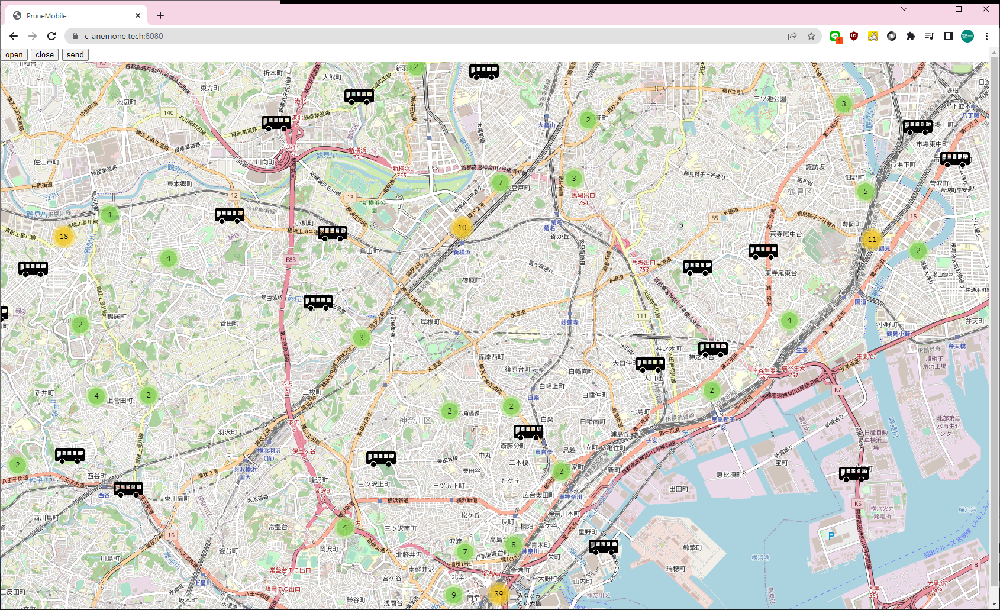

# yoko_bus

公共交通オープンデータセンター 開発者サイト(https://developer.odpt.org/)の
横浜市交通局 バス関連リアルタイム情報 / Bus... バス関連リアルタイム情報 / Bus...
https://ckan.odpt.org/dataset/b_bus_gtfs_rt-yokohamamunicipal
の、

```
バス関連リアルタイム情報 / Bus realtime information
URL: https://api.odpt.org/api/v4/gtfs/realtime/YokohamaMunicipalBus_vehicle?acl:consumerKey=[発行されたアクセストークン/YOUR_ACCESS_TOKEN]

横浜市交通局の市営バスのバス関連リアルタイム情報を提供します。 / Bus realtime information of Transportation Bureau, City of Yokohama

各車両のリアルタイムの現在地情報 (VehiclePosition) を提供します。
```
を使って、バス関連のリアルタイム情報を取得して、地図上にバスの位置を表示するプログラムです(自分用)

更新時間は30秒です。

[発行されたアクセストークン/YOUR_ACCESS_TOKEN]は、自分で取得する必要があります。
(プログラム中のトークンや暗号鍵はダミーです(江端独自の可換処理済み>忘れるな、自分)

# 動かし方
Amazon Lightsailを2つ立ち上げる。

1つ目のコマンド画面で以下を行う。
```
cd yoko_bus/PruneMobile
go run server.go
```

2つ目のコマンド画面で以下を行う。
cd yoko_bus/gtfs
go run gtfs_hub.go

ブラウザを立ち上げる
https://c-anemone.tech:8080/


# 現状
Amazon Lightsail上で、実験的に動かしています。

https://c-anemone.tech:8080/




# 参考メモ
「Protocol Buffersって何？ 」から、「公共交通オープンデータ」を攻略する

https://wp.kobore.net/江端さんの技術メモ/post-9594/
